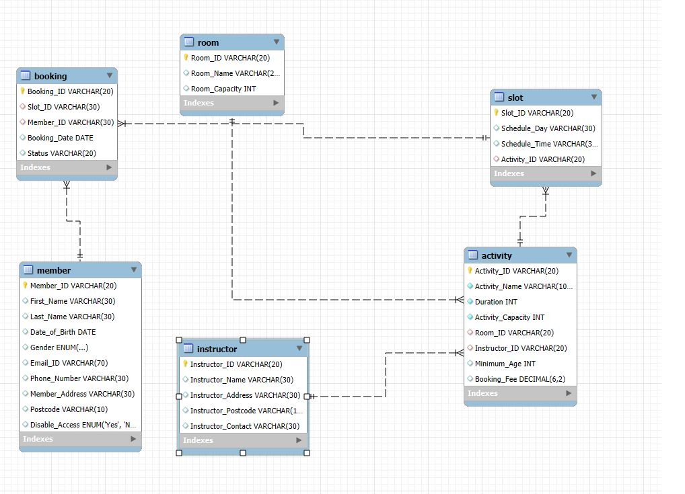

# Data Analyst

### Technical Skills: Advanced Microsoft Excel, SQL, Python, Power Bi, SPSS

## Projects
### Cyclistic Bike-Share: Data-Driven Strategy to Convert Casual Riders into Members

Using Power Bi to analyze usage data from Cyclistic, a bike-share program in Chicago, to understand the behavioral differences between casual riders and annual members. By examining patterns in ride duration, time of day, and station usage. To uncovered key insights that informed a targeted marketing strategy aimed at converting casual riders into loyal members.. The goal was to increase membership conversions, and the final recommendations were supported by compelling visualizations and data-driven storytelling for executive approval.

[Cyclistic Analysis Report](https://drive.google.com/file/d/1Jo5w2xFfAXT4jXYzVAfHxwdSZabav3LT/view?usp=sharing)

The First Dashboard
# 

The Second Dashboard
# 

### Core29 Business Intelligence Dashboard: Visualizing Workload, Project Status & Customer Engagement

This project for Core29 involved designing a data-driven report using dashboard visualizations to support executive decision-making. The analysis focused on team utilization, project workload, and customer issue resolution. Key findings included a 39% overall task completion rate and an imbalance in workload distribution. One team member handled 17 projects while another had only three. Additionally, 60.6% of customer issues remained unresolved, with significant delays seen in key clients like Cyberdyne Systems UK. Billable hours were maximized, particularly in internal projects, while some projects with high time investment had no resolved issues, requiring further investigation. The dashboards provided actionable KPIs, helping Core29 identify inefficiencies and enhance operational and customer service performance.

### Team Utilization and Employee Workload Dashboard
[Publication](https://public.tableau.com/views/Core29Dashboard/ManagerDashboard?:language=en-US&publish=yes&:sid=&:redirect=auth&:display_count=n&:origin=viz_share_link)

### Customer Satisfaction Dashboard
[Publication](https://public.tableau.com/views/CustomerStatisfaction_Core29/CustomerDashboard?:language=en-US&publish=yes&:sid=&:redirect=auth&:display_count=n&:origin=viz_share_link)

[Report Analysis](https://drive.google.com/file/d/1UwEf09JnGISSWp0nsS9hyEeXiXHy57Ux/view?usp=sharing)

### Predictive Modeling for Opioid Overprescription

This project presents a predictive analysis addressing the opioid overprescription crisis, using a dataset of 24,759 observations with 255 features. Key factors such as doctor specialty, state, gender, and drug type were explored. A Random Forest Classifier was chosen for its robustness and interpretability. The model achieved 92% accuracy, 96% precision, 91% sensitivity, 94% specificity, and a 93% F1-score. The analysis identified the top 15 features contributing to overprescription, offering actionable insights. This model can aid the U.S. Drug Enforcement Agency in proactively identifying high-risk prescribers for intervention and regulatory oversight.

### Drug Prescrption Python Code
[Python Code](https://nbviewer.org/github/okemichael/Michael_Portfolio/blob/main/Prescription.ipynb)

### Claims Management Optimization in Auto Insurance

This project analyzes four years of motor insurance data to uncover patterns in claims and premiums. By cleaning, merging, and transforming two datasets, the study evaluates customer risk using incurred claim ratios. Key insights include vehicle type, area, premium value, and claims history. The result enables insurers to optimize pricing, detect fraud, and enhance financial planning, ultimately reducing solvency risk and improving portfolio management.

### Claims Management Python Code
[Python Code](https://htmtopdf.herokuapp.com/ipynbviewer/temp/ab6b5b67e34446abe2928e61a4f78857/Claims%20Managementt.ipynb.html?t=1745464334605)

### Community Facility Database Design and Documentation

This project involved designing and documenting a relational database system for managing a community center's operations. The database tracks rooms, scheduled activities, instructors, members, time slots, and bookings. It includes six core tables—Room, Instructor, Activity, Member, Slot, and Booking. Each with defined attributes, constraints, and relationships. Foreign keys enforce referential integrity, and default values ensure data consistency. The schema enables efficient scheduling, member registration, and resource management. Comprehensive data dictionary documentation outlines the structure and purpose of each table. This system supports streamlined administration and improved service delivery within the community facility.

Entity-Relationship Diagram)
# 

Database Schema Documentation
[Documentation](https://drive.google.com/file/d/1Jo5w2xFfAXT4jXYzVAfHxwdSZabav3LT/view?usp=sharing)
